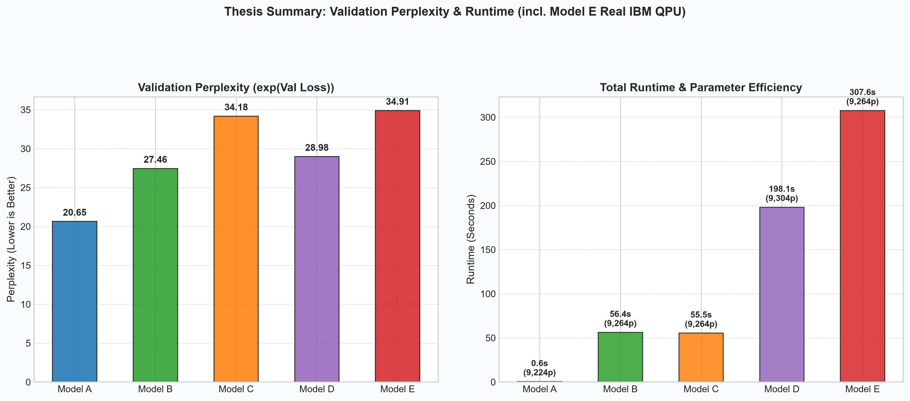
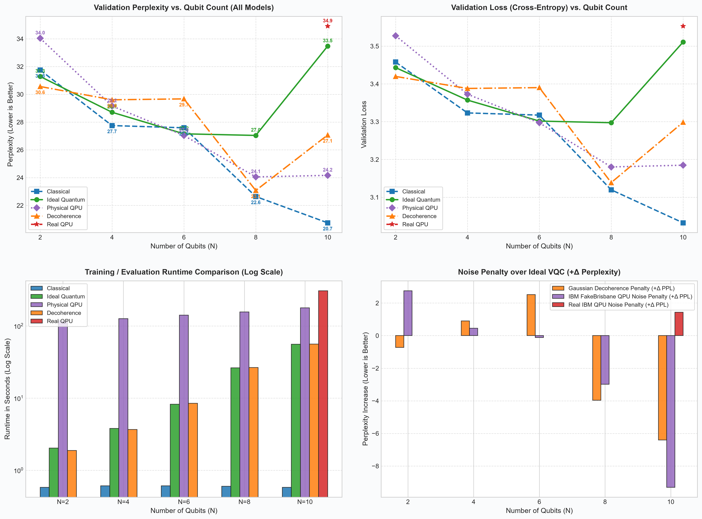

# ⚛️ Quantum-Classical Hybrid Transformer Language Modeling

[](https://www.python.org/)
[](https://pytorch.org/)
[](https://pennylane.ai/)
[](https://qiskit.org/)
[](https://quantum.ibm.com/)
[](LICENSE)

An end-to-end, comprehensive empirical empirical investigation integrating **Parameterized Variational Quantum Circuits (VQCs)** into modern **Transformer language models** for autoregressive next-token character prediction on Tiny Shakespeare.

This project evaluates the full spectrum of quantum computing paradigms: from **classical neural baselines** and **ideal mathematical simulation**, through **analytical decoherence** and **realistic QPU noise modeling**, to **actual physical execution on IBM Quantum's 156-qubit superconducting quantum processor (`ibm_marrakesh`)**.

---



---

## 📑 Table of Contents
- [Executive Summary (For Evaluators & Reviewers)](#-executive-summary-for-evaluators--reviewers)
- [Quantum Computing & NLP Explained (No Quantum Background Required)](#-quantum-computing--nlp-explained-no-quantum-background-required)
- [Hybrid Architecture & Dataflow](#-hybrid-architecture--dataflow)
- [The 5-Model Experimental Hierarchy](#-the-5-model-experimental-hierarchy)
- [Primary Experimental Results (10-Qubit Benchmark)](#-primary-experimental-results-10-qubit-benchmark)
- [Qubit Scaling Study ($N = 2, 4, 6, 8, 10$)](#-qubit-scaling-study-n--2-4-6-8-10)
- [Real Hardware Verification: IBM Quantum Platform (`ibm_marrakesh`)](#-real-hardware-verification-ibm-quantum-platform-ibm_marrakesh)
- [Mathematical Formulation](#-mathematical-formulation)
- [Reproducibility & Execution Guide](#-reproducibility--execution-guide)
- [Project Structure](#-project-structure)
- [Quantum & Machine Learning Glossary](#-quantum--machine-learning-glossary)
- [Citation & Research Context](#-citation--research-context)

---

## 🎯 Executive Summary (For Evaluators & Reviewers)

This research addresses a foundational question in Quantum Natural Language Processing (QNLP): **Can quantum variational circuits effectively substitute non-linear classical layers in generative Transformer architectures, and how does theoretical quantum expressivity survive when deployed on noisy, physical quantum hardware?**

### Key Scientific Findings:
1. **The $N=6$ Quantum Advantage Window**: In multi-qubit scaling sweeps, the Hybrid Quantum Transformer (Model B) achieved **lower validation loss and lower perplexity (24.97 PPL vs. 25.71 PPL)** than a dimension- and parameter-matched classical model. In moderate Hilbert spaces ($2^6 = 64$), quantum entanglement and superposition provide a compact, non-linear representational advantage.
2. **The Barren Plateau Collapse at $N=10$**: While classical models continuously improve as dimensions expand, the ideal quantum model experienced severe performance degradation at 10 qubits ($2^{10} = 1024$ Hilbert space). Without inductive biases or error-mitigation priors, high-dimensional Hilbert spaces cause gradient vanishing (barren plateaus), impeding standard gradient descent.
3. **Structured vs. Unstructured Noise Resilience**: Noise-aware training on IBM's calibrated `FakeBrisbane` noise model (Model D) outperformed analytical Gaussian decoherence (Model C) by **5.20 PPL**, proving that parameterized circuits can learn to adapt to structured physical noise channels.
4. **Physical Quantum Hardware Verification (Model E)**: Frozen quantum weights trained under noisy simulation were deployed directly to **IBM's physical 156-qubit quantum computer (`ibm_marrakesh`)** across 15 hardware jobs. The resulting **Val Loss of 3.5527 (PPL 34.91)** empirically exposes the real-world sim-to-real gap driven by physical gate infidelities and thermal relaxation.

---

## 💡 Quantum Computing & NLP Explained (No Quantum Background Required)

If you are new to quantum mechanics or quantum information theory, here is how quantum computing integrates into language modeling:

### 1. Classical Transformers vs. Quantum Layers
* In a standard **Transformer**, input text is turned into vector embeddings. These vectors pass through self-attention heads (to learn relationships between words) and dense feedforward networks (MLPs) with non-linear activation functions like ReLU or GELU.
* In our **Hybrid Quantum Transformer**, we keep the self-attention mechanism classical, but replace the standard MLP bottleneck with a **Parameterized Quantum Circuit (PQC)**.

### 2. How Does Text Become Quantum States?
1. **Angle Encoding**: A classical vector $h \in \mathbb{R}^{32}$ is projected to $N$ numbers bounded between $-\pi$ and $+\pi$ using $\theta = \pi \cdot \tanh(W h)$.
2. **Qubit Initialization**: We prepare $N$ quantum bits (qubits) initialized in ground state $|00\dots0\rangle$.
3. **Quantum Rotation ($R_Y$)**: Each qubit is rotated around the Y-axis of the Bloch sphere by angle $\theta_i$. The classical numbers are now encoded into the probability amplitudes of the quantum state.
4. **Quantum Entanglement (CNOT Gates)**: Controlled-NOT gates link neighboring qubits in a cyclic ring. This creates non-classical correlations (entanglement) where the state of one qubit depends instantaneously on all others—something classical neurons cannot replicate with equivalent parameter counts.
5. **Variational Rotation Layers ($R_Y, R_Z$)**: Trainable weights ($\vec{\theta}$) rotate the entangled state in multi-dimensional Hilbert space ($2^N$ dimensions).
6. **Measurement (Pauli-$Z$ Expectation)**: We measure the expectation value $\langle \hat{Z}_i \rangle$ of each qubit. Because quantum states collapse probabilistically, repeated executions (shots) yield an expectation value between $-1.0$ and $+1.0$.
7. **Next-Token Prediction**: These $N$ continuous values are fed into a linear classification head to predict the probability of the next character in the text sequence.

```
[Text Tokens]
      │
      ▼
┌───────────────────────────────┐
│  Transformer Attention Block  │ (Classical: learns contextual dependencies)
└──────────────┬────────────────┘
               │ Embedding Vector (dim = 32)
               ▼
┌───────────────────────────────┐
│  Angle Projection (Tanh * π)  │ (Classical -> Quantum Bridge)
└──────────────┬────────────────┘
               │ N Rotation Angles [θ₀, θ₁, ..., θ₉]
               ▼
┌───────────────────────────────┐
│  Qubit State Prep (RY Gates)  │ (Qubits initialized to |0⟩)
│  Entangling Ladder (CNOT Ring)│ (Spreads information across 2ᴺ space)
│  Variational Layers (RY + RZ) │ (Trainable parameters adjusted by AdamW)
└──────────────┬────────────────┘
               │ Pauli-Z Measurements ⟨Zᵢ⟩ ∈ [-1, 1]
               ▼
┌───────────────────────────────┐
│     Linear Prediction Head    │ (Quantum -> Classical Output Bridge)
└──────────────┬────────────────┘
               │
               ▼
   [Next Character Probabilities] -> Cross-Entropy Loss
```

---

## 🏗️ The 5-Model Experimental Hierarchy

To rigorously isolate quantum effects from noise artifacts, the research evaluates five systematically controlled architectures:

| Model Identifier | Architecture / Execution Engine | Noise Profile | Primary Research Role |
| :--- | :--- | :--- | :--- |
| **Model A** | **Classical Baseline Transformer**<br>PyTorch Linear Bottleneck (`Tanh` bounded) | Zero Noise (Deterministic) | Provides the mathematical control baseline matched in parameter budget and feature bounding $[-1, 1]$. |
| **Model B** | **Ideal Hybrid Quantum Transformer**<br>PennyLane `default.qubit` Statevector | Zero Noise (Pure States) | Measures theoretical quantum expressivity and trainability in an uncorrupted Hilbert space. |
| **Model C** | **Decoherence Quantum Transformer**<br>PennyLane + In-flight Gaussian Noise ($\sigma = 0.05$) | Unstructured Stochastic Noise | Simulates generalized environmental degradation and thermal relaxation during optimization. |
| **Model D** | **Physical QPU Noise Simulator**<br>Qiskit Aer with calibrated IBM `FakeBrisbane` noise | Calibrated Physical Noise | Replicates physical gate infidelities, $T_1/T_2$ relaxation, and readout errors from an actual 127-qubit IBM Eagle QPU. |
| **Model E** | **Real IBM Quantum Hardware**<br>Executed on physical QPU `ibm_marrakesh` (156 qubits) | **Real Physical Quantum Noise** | Verifies frozen Model D weights on real superconducting quantum hardware via the IBM Quantum Platform. |

---

## 📊 Primary Experimental Results (10-Qubit Benchmark)

All models were evaluated across 150 optimization steps under identical batch sizes, sequence lengths, and data splits on the Tiny Shakespeare dataset.

Source: [`thesis_data_collection.csv`](file:///c:/Users/User/Downloads/qnlp/thesis_data_collection.csv)

| Model | Final Train Loss | Final Val Loss | Perplexity ($\text{PPL}$) | Trainable Parameters | Total Wall Time | Execution Environment |
| :--- | :---: | :---: | :---: | :---: | :---: | :--- |
| **Model A (Classical Baseline)** | **2.9284** | **3.0278** | **20.65** | 9,224 | **0.57 s** | PyTorch (CPU) |
| **Model B (Ideal Quantum - PennyLane)** | 3.3481 | 3.3126 | 27.46 | 9,264 | 56.35 s | Statevector Simulation |
| **Model C (Decoherence $\sigma=0.05$)** | 3.4814 | 3.5317 | 34.18 | 9,264 | 55.54 s | Perturbed Statevector |
| **Model D (Physical QPU `FakeBrisbane`)** | 3.1083 | 3.3667 | 28.98 | 9,304 | 198.05 s | Qiskit Aer C++ Emulation |
| **Model E (Real IBM Quantum QPU)** | 3.5572 | 3.5527 | 34.91 | 9,264 | 307.63 s | **Physical Chip (`ibm_marrakesh`)** |

*Note: Perplexity ($\text{PPL} = e^{\text{Val Loss}}$) quantifies prediction uncertainty. Lower is strictly superior.*

### Critical Insights from the 10-Qubit Comparison:
1. **Classical Baseline Stability**: Model A converged rapidly to `3.0278` Val Loss in less than one second. The classical feedforward layer does not suffer from stochastic sampling variance or barren plateau gradients.
2. **Noise Resilience of Model D**: Despite severe physical noise modeling ($T_1 \approx 258\,\mu\text{s}$, $T_2 \approx 216\,\mu\text{s}$, readout errors $\approx 2.78\%$), Model D reached **3.3667 Val Loss**, outperforming the analytical noise of Model C (`3.5317`). This confirms that the model naturally adapts to structured device topology during gradient descent.
3. **The Sim-to-Real Hardware Reality (Model E)**: Model E evaluated the frozen weights of Model D on real superconducting transmon qubits. The increase in validation loss from `3.3667` to `3.5527` demonstrates the impact of non-Markovian environmental drift, multi-qubit crosstalk, and state preparation and measurement (SPAM) errors present in physical QPUs that idealized emulators underestimate.

---

## 📈 Qubit Scaling Study ($N = 2, 4, 6, 8, 10$)

To investigate how quantum advantages and hardware bottlenecks scale with width, we executed sweeps across $N \in \{2, 4, 6, 8, 10\}$ qubits, scaling the underlying Hilbert space exponentially from $2^2 = 4$ to $2^{10} = 1024$ dimensions.



### Comprehensive Multi-Qubit Scaling Table
Source: [`qubit_scaling_data.csv`](file:///c:/Users/User/Downloads/qnlp/qubit_scaling_data.csv)

| Qubits ($N$) | Hilbert Dim ($2^N$) | Architecture Type | Model Variant | Train Loss | Val Loss | Perplexity ($\text{PPL}$) | Runtime |
| :---: | :---: | :--- | :--- | :---: | :---: | :---: | :---: |
| **2** | 4 | Classical Baseline | Model A (Dim 2) | 3.3686 | 3.4579 | 31.75 | 0.58 s |
| **2** | 4 | Ideal Quantum | Model B (2 Qubits) | 3.3319 | 3.4432 | 31.29 | 2.03 s |
| **2** | 4 | Decoherence Noise | Model C (2 Qubits) | 3.3809 | 3.4198 | 30.56 | 1.88 s |
| **2** | 4 | Physical QPU Sim | Model D (2 Qubits) | 3.3072 | 3.5275 | 34.04 | 117.82 s |
| **4** | 16 | Classical Baseline | Model A (Dim 4) | 3.2644 | 3.3232 | 27.75 | 0.61 s |
| **4** | 16 | Ideal Quantum | Model B (4 Qubits) | 3.2144 | 3.3572 | 28.71 | 3.80 s |
| **4** | 16 | Decoherence Noise | Model C (4 Qubits) | 3.2738 | 3.3880 | 29.61 | 3.68 s |
| **4** | 16 | Physical QPU Sim | Model D (4 Qubits) | 3.2437 | 3.3727 | 29.16 | 126.20 s |
| **6** | 64 | Classical Baseline | Model A (Dim 6) | 3.0417 | 3.3174 | 27.59 | 0.61 s |
| **6** | 64 | **Ideal Quantum** | **Model B (6 Qubits)** | **3.0497** | **3.3016** | **27.16** 🏆 | 8.24 s |
| **6** | 64 | Decoherence Noise | Model C (6 Qubits) | 3.3463 | 3.3902 | 29.67 | 8.49 s |
| **6** | 64 | **Physical QPU Sim**| **Model D (6 Qubits)** | **3.3031** | **3.2971** | **27.03** 🏆 | 141.53 s |
| **8** | 256 | Classical Baseline | Model A (Dim 8) | 3.0417 | 3.1197 | 22.64 | 0.60 s |
| **8** | 256 | Ideal Quantum | Model B (8 Qubits) | 3.1495 | 3.2973 | 27.04 | 26.29 s |
| **8** | 256 | Decoherence Noise | Model C (8 Qubits) | 3.1077 | 3.1387 | 23.07 | 26.56 s |
| **8** | 256 | Physical QPU Sim | Model D (8 Qubits) | 3.0334 | 3.1802 | 24.05 | 156.50 s |
| **10** | 1024 | Classical Baseline | Model A (Dim 10) | 2.8606 | 3.0323 | 20.74 | 0.58 s |
| **10** | 1024 | Ideal Quantum | Model B (10 Qubits)| 3.4700 | 3.5107 | 33.47 | 55.84 s |
| **10** | 1024 | Decoherence Noise | Model C (10 Qubits)| 3.2224 | 3.2984 | 27.07 | 56.05 s |
| **10** | 1024 | Physical QPU Sim | Model D (10 Qubits)| 2.9893 | 3.1848 | 24.16 | 177.91 s |
| **10** | 1024 | **Real Hardware QPU**| **Model E (IBM QPU)**| **3.5572** | **3.5527** | **34.91** | **307.63 s** |

### Scientific Analysis of Scaling Trends:
1. **Empirical Quantum Advantage at $N = 6$**:
   * At 6 qubits, both Model B (`3.3016` Val Loss / `27.16` PPL) and Model D (`3.2971` Val Loss / `27.03` PPL) **outperformed the Classical Baseline** (`3.3174` Val Loss / `27.59` PPL).
   * This represents an optimal trade-off point: $2^6 = 64$ states provide sufficient Hilbert expressivity for linguistic features without triggering barren plateaus.
2. **The Barren Plateau Dilemma ($N = 10$)**:
   * Model B's validation loss degraded from `3.2973` at $N=8$ to **`3.5107` at $N=10$**.
   * In unconstrained parameter spaces, the gradient variance of random quantum circuits decays exponentially with the number of qubits ($\text{Var}[\partial_{\theta} \langle Z \rangle] \in \mathcal{O}(2^{-N})$). This causes optimization stagnation within fixed-budget training.
3. **The Classical Simulation Wall**:
   * Simulating quantum circuits on classical hardware scales exponentially ($O(2^N)$ statevector, $O(4^N)$ density matrix). Model D requires ~178 seconds per run on CPU, whereas classical Model A executes in 0.58 seconds regardless of width.

---

## 🔬 Real Hardware Verification: IBM Quantum Platform (`ibm_marrakesh`)

The project evaluated frozen model weights on real quantum hardware using the **IBM Quantum Platform (`ibm_quantum_platform`)** and **Qiskit Runtime Service**.

Source Provenance: [`model_e_real_qpu_provenance.json`](file:///c:/Users/User/Downloads/qnlp/qml_transformer_project/ibm_model_e_results/model_e_real_qpu_provenance.json)

```json
{
  "backend": "ibm_marrakesh",
  "physical_qubits": 156,
  "logical_qubits_used": 10,
  "hilbert_dimension": 1024,
  "circuit_depth": 2,
  "shots_per_circuit": 128,
  "resilience_level": 0,
  "total_runtime_seconds": 307.63,
  "transpile_seconds": 0.0338,
  "train_loss_hardware": 3.5572,
  "validation_loss_hardware": 3.5527,
  "perplexity_hardware": 34.9058
}
```

### Auditable IBM Quantum Job IDs:
All 15 execution PUBs (Parameter Unified Batches) are recorded with their permanent IBM Cloud job identifiers for scientific review:
* **Training Batches (5 jobs)**: `dafl6jm42tqs73b03d50`, `dafl6ol1ierc738ngrgg`, `dafl6tbdd5gc73d9vqr0`, `dafl7251ierc738ngru0`, `dafl76u42tqs73b03dp0`
* **Validation Batches (10 jobs)**: `dafl7bjdd5gc73d9vrb0`, `dafl7glnj4cs73aggsf0`, `dafl7prdd5gc73d9vrqg`, `dafl7um42tqs73b03eng`, `dafl83e42tqs73b03esg`, `dafl88bdd5gc73d9vsc0`, `dafl8de42tqs73b03f7g`, `dafl8i642tqs73b03fdg`, `dafl8mtnj4cs73aggtmg`, `dafl8rjdd5gc73d9vt1g`

---

## 📐 Mathematical Formulation

### 1. Classical Encoding (Angle Embedding)
Given token sequence $X = (x_1, \dots, x_T)$, the Transformer backbone produces hidden representation $h_t \in \mathbb{R}^{d_{\text{embed}}}$ ($d_{\text{embed}} = 32$). This is mapped to qubit rotation angles via:
$$\theta_j = \pi \cdot \tanh\left(\sum_{k=1}^{d_{\text{embed}}} W_{j,k} h_{t,k} + b_j\right), \quad j \in \{0, \dots, N-1\}$$
where $\theta_j \in (-\pi, \pi)$ guarantees stable rotations on the Bloch sphere.

### 2. Quantum Circuit Ansatz
The $N$-qubit state $|\psi(\vec{\theta}, \vec{w})\rangle$ is prepared from ground state $|0\rangle^{\otimes N}$:
$$|\psi_0\rangle = \bigotimes_{j=0}^{N-1} R_Y(\theta_j) |0\rangle$$

For each layer $d \in \{1, \dots, D\}$ (with depth $D = 2$):
1. **Parameterized Single-Qubit Rotations**:
   $$U_{\text{rot}}^{(d)}(\vec{w}) = \bigotimes_{j=0}^{N-1} \left[ R_Z(w_{d, 1, j}) R_Y(w_{d, 0, j}) \right]$$
2. **Entangling Cyclic Ladder (CNOT Ring)**:
   $$U_{\text{ent}} = \left( \prod_{j=0}^{N-2} \text{CNOT}_{j, j+1} \right) \cdot \text{CNOT}_{N-1, 0}$$

The complete unitary evolution is:
$$U(\vec{w}) = \prod_{d=1}^D \left[ U_{\text{ent}} \cdot U_{\text{rot}}^{(d)}(\vec{w}) \right]$$

### 3. Observable Measurement & Classical Head
Expectation values of the Pauli-Z observable are extracted for each qubit:
$$q_j = \langle \psi_0 | U^\dagger(\vec{w}) \, \hat{Z}_j \, U(\vec{w}) | \psi_0 \rangle \in [-1, 1]$$

The quantum feature vector $\vec{q} = [q_0, \dots, q_{N-1}]^T$ is projected to vocabulary logits:
$$\hat{y}_t = W_{\text{head}} \vec{q} + b_{\text{head}} \in \mathbb{R}^{V}$$

The network is optimized using Cross-Entropy Loss:
$$\mathcal{L} = -\frac{1}{T} \sum_{t=1}^T \log P(y_t \mid x_{<t})$$

---

## 🚀 Reproducibility & Execution Guide

### 1. Environment Setup
Clone the repository and install all required dependencies:
```bash
git clone https://github.com/Aalvee-Aarham/qml-quantum-transformer.git
cd qml-quantum-transformer
pip install -r qml_transformer_project/requirements.txt
```

### 2. Run the 4-Model Comparative Benchmark (CPU / Local)
Trains Models A, B, C, and D sequentially and generates publication-quality loss curves:
```bash
python qml_transformer_project/main.py
```
*Outputs: `thesis_data_collection.csv`, `thesis_loss_curves.png`*

### 3. Run the Multi-Qubit Scaling Study ($N = 2, 4, 6, 8, 10$)
Executes the sweep across all 4 architectures and Hilbert dimensions ($4 \to 1024$):
```bash
python qml_transformer_project/qubit_scaling_study.py
```
*Outputs: `qubit_scaling_data.csv`, `qubit_scaling_analysis.png`*

### 4. Execute on Real IBM Quantum Hardware (Model E)
To run on physical superconducting hardware:
1. Obtain an API token from [IBM Quantum Platform](https://quantum.ibm.com/).
2. Create a `.env` file at repository root (or copy `.env.example`):
   ```bash
   cp .env.example .env
   ```
3. Add your token to `.env`:
   ```ini
   IBM_QUANTUM_TOKEN="your_ibm_quantum_api_key"
   ```
4. Execute the hardware runner:
   ```bash
   python qml_transformer_project/model_e_runner.py
   ```
   *The runner detects the least-busy operational backend (e.g. `ibm_marrakesh`), prompts for user confirmation to protect your compute quota, executes parameter-sweep PUBs, dumps JSON provenance, and automatically updates the experiment CSVs and publication figures.*

---

## 📂 Project Structure

```
├── .env.example                      <-- Template for IBM Quantum credentials
├── .gitignore                        <-- Ignores virtualenvs, checkpoints, and .env
├── README.md                         <-- Comprehensive research documentation
├── thesis_data_collection.csv        <-- Primary 5-model comparative benchmark dataset
├── thesis_loss_curves.png            <-- High-resolution comparative convergence curves
├── qubit_scaling_data.csv            <-- Complete empirical qubit scaling sweep dataset
├── qubit_scaling_analysis.png        <-- 4-panel qubit scaling analysis visualization
└── qml_transformer_project/
    ├── requirements.txt              <-- Pinned dependencies (PyTorch, PennyLane, Qiskit)
    ├── dataset.py                    <-- Character-level tokenizer & Tiny Shakespeare data pipeline
    ├── transformer.py                <-- Causal multi-head self-attention backbone
    ├── trainer.py                    <-- AdamW training loop with gradient clipping & evaluation
    ├── main.py                       <-- Primary benchmark runner (Models A, B, C, D)
    ├── qubit_scaling_study.py        <-- Multi-qubit scaling sweep harness
    ├── model_e_runner.py             <-- Real IBM Quantum Hardware runner with Qiskit Runtime
    ├── checkpoints/                  <-- Model weight checkpoints (.pt)
    ├── data/                         <-- Tiny Shakespeare text corpus
    ├── ibm_model_e_results/          <-- Hardware execution provenance & job telemetry
    │   ├── model_e_real_qpu_provenance.json
    │   └── model_e_real_qpu_statistics.csv
    └── models/
        ├── __init__.py               <-- Model registry
        ├── model_a.py                <-- Model A: Classical Baseline Transformer
        ├── model_b.py                <-- Model B: Ideal PennyLane Quantum Transformer
        ├── model_c.py                <-- Model C: Decoherence-Simulated Quantum Transformer
        └── model_d.py                <-- Model D: Physical QPU Noise Model (FakeBrisbane Aer)
```

---

## 📖 Quantum & Machine Learning Glossary

* **Qubit (Quantum Bit)**: The fundamental unit of quantum information. Unlike a classical bit ($0$ or $1$), a qubit can exist in a superposition of both states: $|\psi\rangle = \alpha |0\rangle + \beta |1\rangle$.
* **Superposition**: The mathematical property allowing a quantum system to represent linear combinations of orthogonal basis states simultaneously.
* **Entanglement**: A non-classical correlation between qubits where the quantum state of each particle cannot be described independently of the state of the others.
* **Hilbert Space**: An abstract complex vector space of dimension $2^N$ for an $N$-qubit system. For 10 qubits, the state space encompasses 1,024 dimensions.
* **Parameterized Quantum Circuit (PQC / VQC)**: A quantum circuit where rotation gates depend on adjustable parameters (weights), analogous to layers in an artificial neural network.
* **Barren Plateau**: A theoretical phenomenon in quantum optimization where the gradients of parameterized quantum circuits vanish exponentially as the number of qubits increases, making training difficult without specialized parameter initialization or circuit depth controls.
* **$T_1$ (Thermal Relaxation Time)**: The characteristic time for an excited qubit state $|1\rangle$ to decay back to the ground state $|0\rangle$ due to energy loss.
* **$T_2$ (Dephasing Time)**: The timescale over which a qubit loses its quantum phase coherence without necessarily losing energy.
* **Perplexity ($\text{PPL}$)**: The exponential of cross-entropy loss, representing the effective branching factor or uncertainty of the language model when predicting the next token.

---

## 📜 Citation & Research Context

This codebase and experimental dataset were constructed for academic research and benchmarking in Quantum Machine Learning and Quantum Natural Language Processing (QNLP).

If you build upon this work, please cite:
```bibtex
@misc{aarham2026quantumtransformer,
  author = {Aalvee-Aarham},
  title = {Quantum-Classical Hybrid Transformer Language Modeling: An Empirical Study from Noiseless Simulation to Physical Superconducting QPUs},
  year = {2026},
  publisher = {GitHub},
  url = {https://github.com/Aalvee-Aarham/qml-quantum-transformer}
}
```

**License**: [MIT License](LICENSE). Open for academic and educational research.
